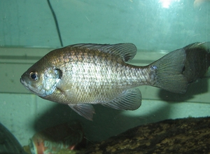
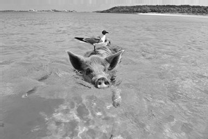
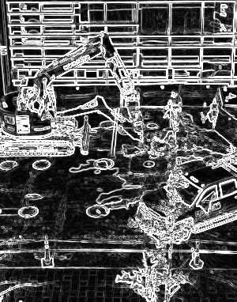

#PSET 1 - Processamento de imagens
--
Feito por: Vinícius Teixeira Melo, da turma CC3M - UVV - 

Data de entrega: 02/06/2023

--
QUESTÃO 01: se você passar essa imagem pelo filtro de inversão, qual seria o
output esperado? Justifique sua resposta.
    Eu esperava que a imagem retornasse com os valores de cor invertidos. 
    Pois o nome da função é inverter e a função invertida aplica "255 menos a cor atual". 
    O que gera uma nova cor que a distancia entre 0 e 255 sejam iguais. 
    Exemplo: A cor 10 esta a 10 numeros de distancia de 0, enquanto a cor 245 está a 10 numeros de diatancia de 255
        def invertida(self):
        return self.aplicar_por_pixel(lambda c: 255 - c)

QUESTÃO 2: Execute seu filtro de inversão na imagem imagens_teste/peixe.png, 
salve o resultado como uma imagem PNG e salve a imagem em seu repositório GitHub.
Entrada:

Saida:

QUESTÃO 3: Considere uma etapa de correlacionar uma imagem com o seguinte kernel:

calculo
0.00 x 80 = 0
-0,07 x 53 = -3, 71
0.00 x 99 = 0
-0.45 x 129 = -58.05
1.20 x 127 = 152.4
-0.25 x 148 = -37
0.00 x 175 = 0
-0.12 x 174 = -20.88
0.00 x 193 = 0
Resposta = 0 + -3, 71 + 0 + -58.05 + 152.4 + -37 + 0 + -20.88 + 0 = 32.76

QUESTÃO 4:

QUESTÃO 5:
kernel =    [[-1/9, -1/9, -1/9],
             [-1/9, 17/9, -1/9],
             [-1/9, -1/9, -1/9]]

QUESTÃO 6:

o kernel lateral retorna a detectação de bordas pela horizontal
o kernel vertical retorna a detectação de bordas pela vertical

